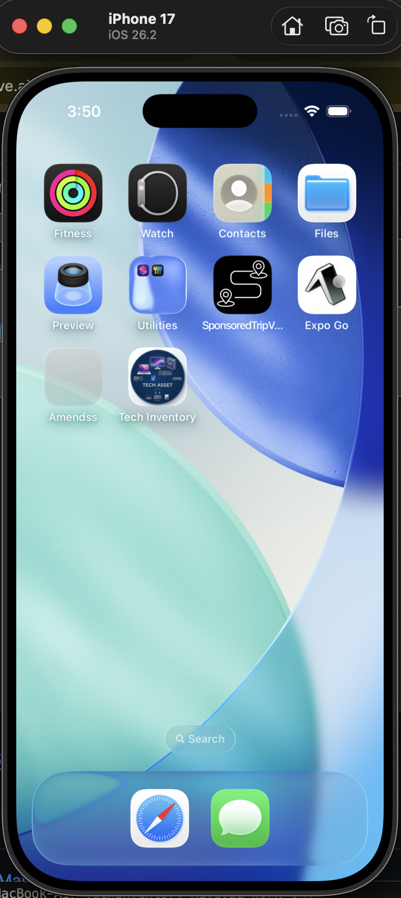
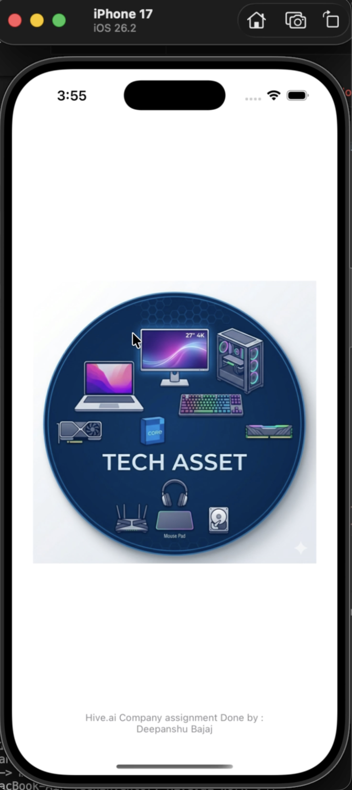
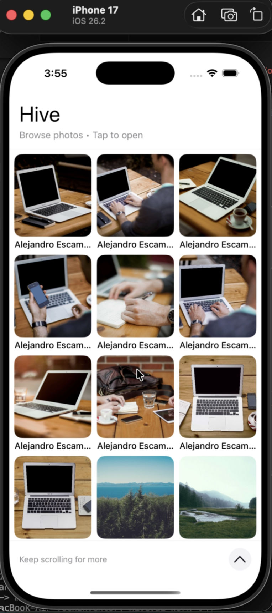
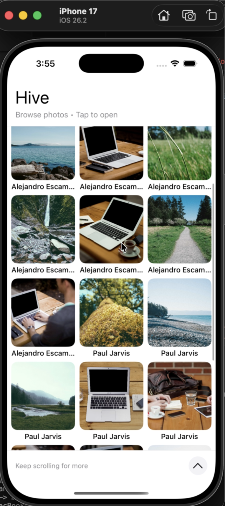
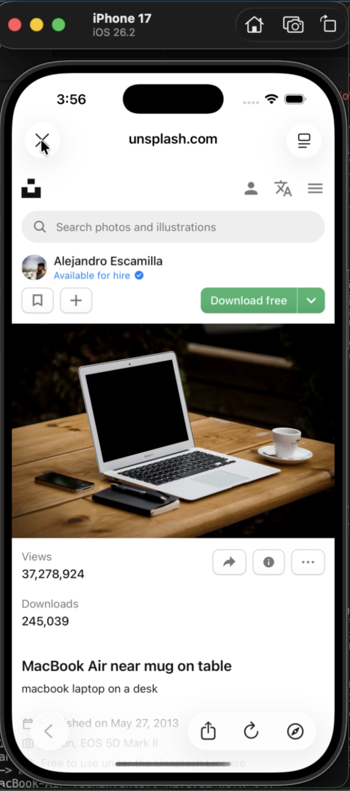

<h1 align="center">Tech Inventory - iOS App</h1>

<p align="center">
  ( Hive.ai by Chatous Technologies Pvt. Ltd. )
</p>

<p align="center">
  
  
  
  
  
  
  
</p>

**Tech Inventory (Hive.ai)** is a lightweight iOS assignment app for **Hive.ai by Chatous Technologies Pvt. Ltd.**. It demonstrates a paginated photo grid using **UIKit**, backed by a simple networking layer with `URLSession`.

The app fetches images from the public **Lorem Picsum** API and displays them in a `UICollectionView`. Tapping an item opens the image’s source URL in an in-app Safari view (`SFSafariViewController`).

---

## ✨ Features

- **Grid UI**: 3-column photo grid with responsive cell sizing
- **Pagination**: Infinite scrolling (loads next page near the bottom)
- **Details**: Tap an item to open its source URL in-app
- **Loading State**: Activity indicator while fetching pages

---

## 📦 Requirements

- iOS **18.5+** (deployment target in `Hive.xcodeproj` — change in Xcode if needed)
- Xcode **16.4+** (project created with Tools Version 16.4)
- Swift **5.0**

---

## ⛓ Project Structure

    TechInventory-Hive.ai-Work
    .
    ├── Hive                   # Main iOS app target
    │   ├── ViewController.swift
    │   ├── ImageService.swift
    │   ├── ImageModel.swift
    │   ├── ImageCell.swift
    │   ├── HeaderView.swift
    │   ├── Assets.xcassets
    │   └── Base.lproj         # Storyboards (Main, LaunchScreen)
    ├── HiveTests              # Unit tests
    ├── HiveUITests            # UI tests
    ├── Hive.xcodeproj
    └── LICENSE

---

## 🛠️ Installation

1. Clone the repository:
   ```bash
   git clone https://github.com/deepanshubajaj/TechInventory-Hive.ai-Work.git
   ```

2. Open in Xcode:
   ```bash
   open Hive.xcodeproj
   ```

3. Build and run on a simulator or device (Scheme: `Hive`).

---

## 🧪 Running Tests

From Xcode: Product → Test

From the command line:

```sh
xcodebuild test -project Hive.xcodeproj -scheme Hive -destination 'platform=iOS Simulator,name=iPhone 16'
```

If the destination name doesn’t exist on your machine, list available simulators and pick one:

```sh
xcrun simctl list devices
```

---

## 🌐 API

- Image list: `https://picsum.photos/v2/list?page={page}&limit=10`
- No API key required

---

## 🎨 App Look:

<p align="center">
  
</p>
<p align="center">
  *App snapshot in the simulator.*
</p>

---

## 🖼️ Screenshots:

<p align="center">
  
</p>

<p align="center">
  *Splash screen displayed upon app launch.*
</p>

##

<p align="center">
    
    
    
</p>

<p align="center">
  *Screenshots of the Tech Inventory App showing different screens*
</p>

---

## 📱 App Icon:

<p align="center">
  
</p>
<p align="center">
  *The App Icon reflects the Tech Inventory Look*
</p>

---

## 🚀 Video Demo:

Here’s a short video showcasing the app's functionality:

<p align="center">
  
</p>

➤ <a href="ProjectOutputs/WorkingVideo/WorkingVideoD.MP4">🎥 Watch Working Video</a>

---

## 🤝 Contributing

Contributions are welcome.

1. Fork the repository
2. Create a feature branch:
   ```bash
   git checkout -b feature/your-feature-name
   ```
3. Commit your changes:
   ```bash
   git commit -m "Add your feature"
   ```
4. Push and open a pull request

---

## 📃 License:

This project is licensed under the [Apache-2.0 License](./LICENSE).  
You are free to use this project for personal, educational, or commercial purposes — just make sure to provide proper attribution.

> **Clarification:** Commercial use includes, but is not limited to, use in products,  
> services, or activities intended to generate revenue, directly or indirectly.
